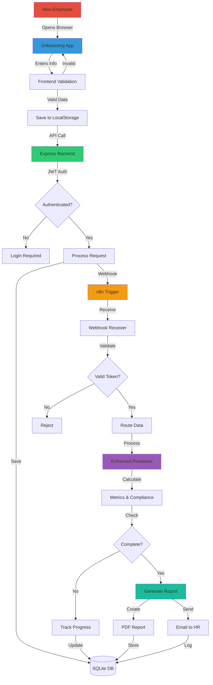

# 🔄 FSW Onboarding System - Workflow Diagram

## Complete System Flow



## Data Flow by Module

### 1. Employee Registration
```
Browser → Form Data → Validation → API → Database → n8n → HR Email
```

### 2. Video Progress
```
Video Player → Track Time → Calculate % → Save State → API → Analytics
```

### 3. Document Download
```
Click Download → Track Event → Mark Complete → Update Progress → Sync
```

### 4. Module Completion
```
Complete Module → Update State → Calculate Score → API → Certificate
```

### 5. Final Submission
```
All Complete → Generate Report → Email HR → Archive → Close Case
```

## n8n Workflow Components

```
┌─────────────────────────────────────────────┐
│              MAIN WORKFLOW                   │
├─────────────────────────────────────────────┤
│                                             │
│  [Webhook] → [Receiver] → [Router]         │
│      ↓           ↓           ↓             │
│  [Processor] [Database] [Notifications]     │
│      ↓           ↓           ↓             │
│  [Reports]   [Archive]   [Email]           │
│                                             │
└─────────────────────────────────────────────┘
```

## State Management

```javascript
appState = {
    currentTab: 'welcome',
    progress: 0,
    completedModules: [],
    employeeData: {},
    checklistItems: {},
    procedureAcknowledgments: {},
    formCompletions: {},
    digitalSignatures: {},
    analytics: {
        sessionStart: Date.now(),
        timeSpentPerTab: {},
        totalTimeSpent: 0,
        completionTimes: {},
        interactions: [],
        lastActivity: Date.now()
    }
}
```

## API Endpoints Flow

```
Frontend                 Backend                 n8n
   │                        │                      │
   ├──POST /api/auth────────→                     │
   │                        ├──JWT Token──→        │
   │                        │                      │
   ├──GET /api/employee─────→                     │
   │                        ├──Query DB───→        │
   │                        ←──Data────────        │
   ←──JSON Response─────────                      │
   │                        │                      │
   ├──PUT /api/progress─────→                     │
   │                        ├──Update DB──→        │
   │                        ├──Webhook─────────────→
   │                        │                      ├──Process
   │                        │                      ├──Notify
   │                        │                      └──Report
   ←──Success───────────────                      │
```

## Security Layers

```
1. Frontend Validation (HTML5 + JavaScript)
   ↓
2. HTTPS Transport (SSL/TLS)
   ↓
3. CORS Protection (Express)
   ↓
4. Rate Limiting (express-rate-limit)
   ↓
5. Input Sanitization (express-validator)
   ↓
6. JWT Authentication (jsonwebtoken)
   ↓
7. SQL Injection Prevention (Prepared Statements)
   ↓
8. XSS Protection (Helmet.js)
   ↓
9. Webhook Token Validation (n8n)
   ↓
10. Audit Logging (Database)
```

## Performance Optimization

```
┌─────────────┐     ┌─────────────┐     ┌─────────────┐
│   Browser   │────→│   CDN       │────→│   Server    │
│             │     │             │     │             │
│ LocalStorage│     │ Static Files│     │ Express.js  │
│   Cache     │     │   Images    │     │   API       │
│             │     │   CSS/JS    │     │             │
└─────────────┘     └─────────────┘     └─────────────┘
                            ↓                   ↓
                    ┌─────────────┐     ┌─────────────┐
                    │ Compression │     │  Database   │
                    │   (gzip)    │     │  (SQLite)   │
                    └─────────────┘     └─────────────┘
```

## Error Handling Flow

```
Error Occurs
    ↓
Try/Catch Block
    ↓
Log to Console
    ↓
Show User Message
    ↓
Send to Backend
    ↓
Log to Database
    ↓
Alert Admin (if critical)
    ↓
Attempt Recovery
    ↓
Fallback State
```

## Monitoring Points

```
[Browser Metrics]
    • Page Load Time
    • JS Errors
    • Network Failures

[API Metrics]
    • Response Time
    • Error Rate
    • Request Volume

[Database Metrics]
    • Query Time
    • Connection Pool
    • Disk Usage

[n8n Metrics]
    • Execution Success
    • Processing Time
    • Queue Length

[Business Metrics]
    • Completion Rate
    • Time to Complete
    • Drop-off Points
```

---

**Visual Guide Version**: 1.0  
**Last Updated**: January 2025  
**Tool**: Can be rendered with Mermaid viewers or GitHub
